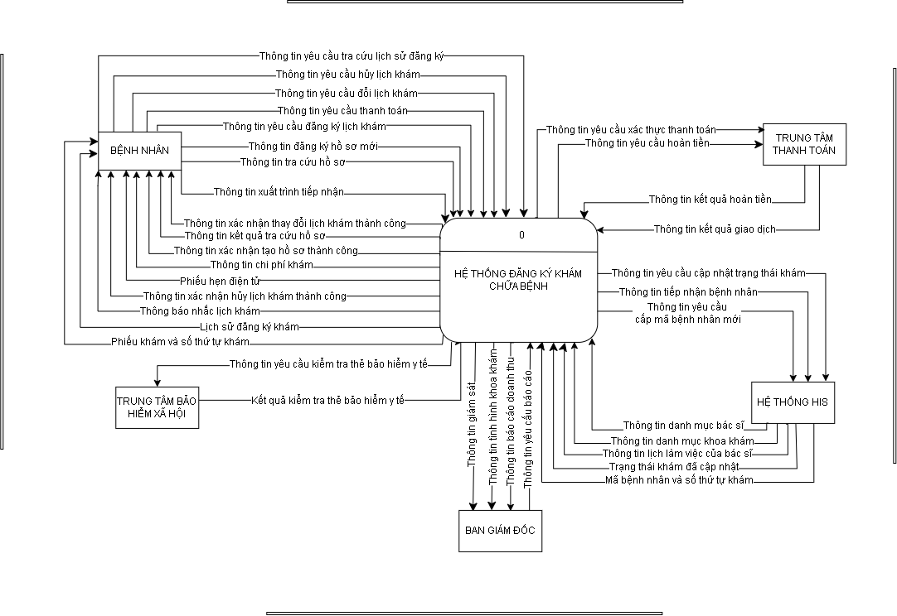
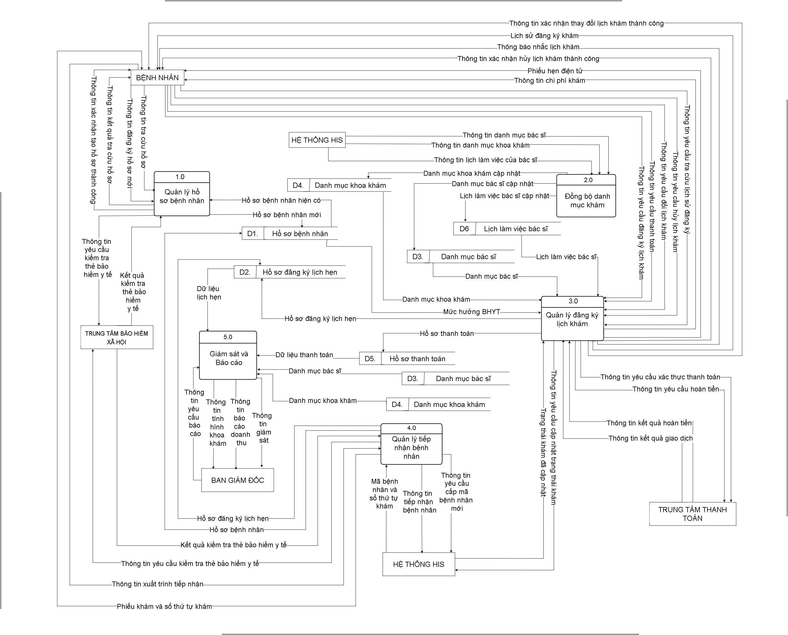
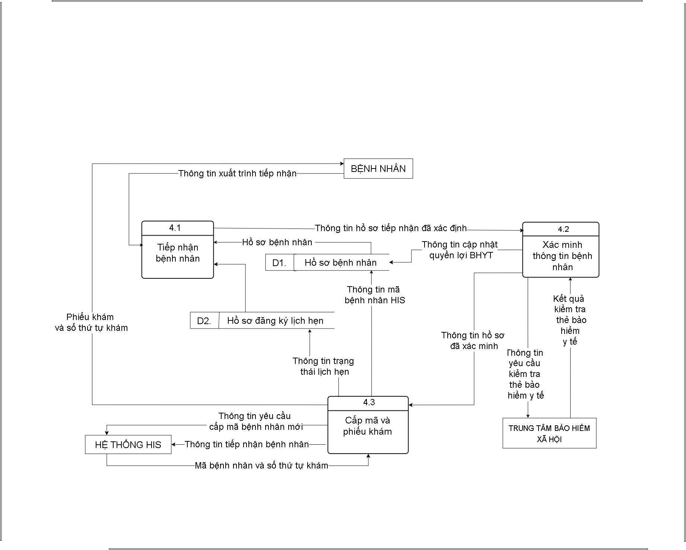

# Sơ Đồ Quy Trình & Luồng Dữ Liệu (Process & Data Models)
Thư mục này chứa Sơ đồ Quy trình Nghiệp vụ (BPC) và Hệ thống Sơ đồ Luồng Dữ liệu (DFD) theo chuẩn Top-Down: Sơ đồ Ngữ cảnh (Context Diagram), Sơ đồ Mức đỉnh (DFD Level 0) và Sơ đồ Mức 1 (DFD Level 1 - Phân hệ Tiếp nhận Bệnh nhân).
### 1. Sơ Đồ Ngữ Cảnh (Context Diagram)
> Xác định phạm vi tổng quan hệ thống và các luồng thông tin trao đổi với Tác nhân bên ngoài.

---

### 2. Sơ Đồ Luồng Dữ Liệu Mức Đỉnh (DFD Level 0)
> Phân rã hệ thống bệnh viện thành các phân hệ chức năng chính.

---

### 3. Sơ Đồ Luồng Dữ Liệu Mức 1 (DFD Level 1 - Phân Hệ Quản lý Tiếp Nhận)
> Phân tích chi tiết các tiến trình, luồng dữ liệu và kho dữ liệu cho Phân hệ Quản lý Tiếp nhận bệnh nhân.

