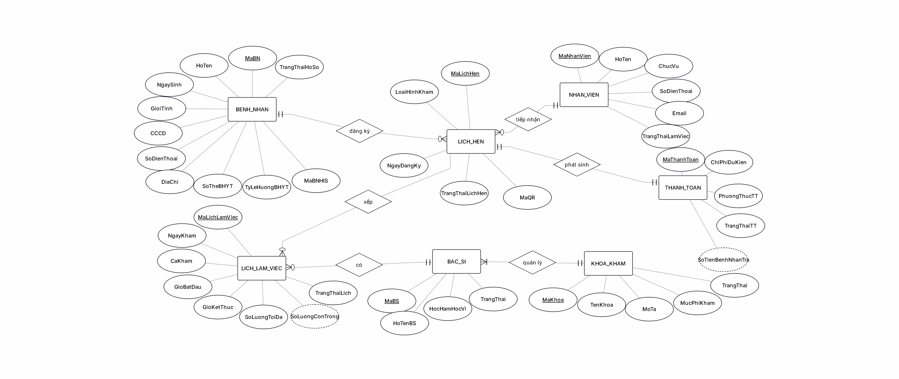

# MÔ HÌNH DỮ LIỆU & KIẾN TRÚC CƠ SỞ DỮ LIỆU
> **Trọng tâm:** Biểu đồ Thực thể - Liên kết (ERD) & Mô hình Quan hệ (RD)

---

## TỔNG QUAN
Thư mục này chứa các mô hình dữ liệu cấu trúc phục vụ thiết kế **Hệ thống Quản lý Đăng ký Khám bệnh**. Cơ sở dữ liệu đã được chuẩn hóa đạt dạng chuẩn 3 (3NF) nhằm loại bỏ dư thừa dữ liệu, đảm bảo tính toàn vẹn.

---

## 1. BIỂU ĐỒ THỰC THỂ - LIÊN KẾT (ERD)

*Sơ đồ ERD thể hiện mối quan hệ giữa 7 thực thể chính (`BENH_NHAN`, `NHAN_VIEN`, `BAC_SI`, `KHOA_KHAM`, `LICH_LAM_VIEC`, `LICH_HEN`, `THANH_TOAN`).*

---

## 2. MÔ HÌNH QUAN HỆ (RD)

> **Quy ước:** `(PK)` = Khóa chính | `(FK)` = Khóa ngoại

* **BENH_NHAN** (**MaBN** *(PK)*, HoTen, NgaySinh, GioiTinh, CCCD, SoDienThoai, DiaChi, SoTheBHYT, TyLeHuongBHYT, MaBNHIS, TrangThaiHoSo)
* **NHAN_VIEN** (**MaNhanVien** *(PK)*, HoTen, ChucVu, SoDienThoai, Email, TrangThaiLamViec)
* **KHOA_KHAM** (**MaKhoa** *(PK)*, TenKhoa, MoTa, MucPhiKham, TrangThai)
* **BAC_SI** (**MaBS** *(PK)*, HoTenBS, HocHamHocVi, TrangThai, MaKhoa *(FK)*)
* **LICH_LAM_VIEC** (**MaLichLamViec** *(PK)*, NgayKham, CaKham, GioBatDau, GioKetThuc, SoLuongToiDa, TrangThaiLich, MaBS *(FK)*)
* **LICH_HEN** (**MaLichHen** *(PK)*, LoaiHinhKham, NgayDangKy, TrangThaiLichHen, MaQR, MaBN *(FK)*, MaNhanVien *(FK)*, MaLichLamViec *(FK)*)
* **THANH_TOAN** (**MaThanhToan** *(PK)*, NgayThanhToan, ChiPhiDuKien, PhuongThucThanhToan, TrangThaiThanhToan, MaLichHen *(FK)*)

---

## CÔNG CỤ SỬ DỤNG
* **ERDPlus**: Thiết kế sơ đồ ERD.
