# THIẾT KẾ GIAO DIỆN UI/UX HỆ THỐNG
> **Trọng tâm:** Mô phỏng giao diện người dùng (UI/UX Mockups) các màn hình chức năng

---

## TỔNG QUAN
Thư mục này trình bày các bản vẽ thiết kế giao diện người dùng (UI/UX Mockups) phục vụ toàn bộ luồng nghiệp vụ của **Hệ thống Quản lý Đăng ký Khám bệnh**.

---

## MÀN HÌNH GIAO DIỆN HỆ THỐNG (UI/UX PROTOTYPES)

### Màn hình xác thực & Trang chủ
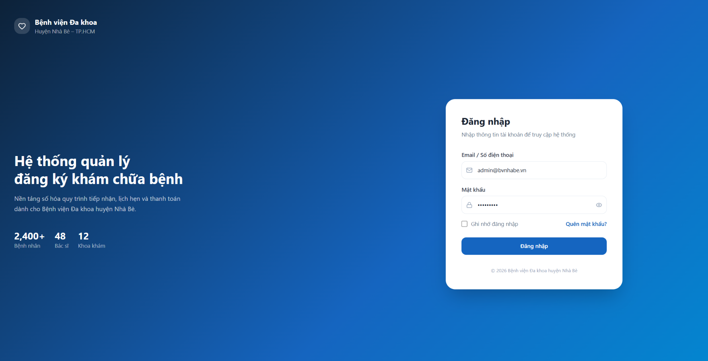
*Hình 3.2. Giao diện đăng nhập*

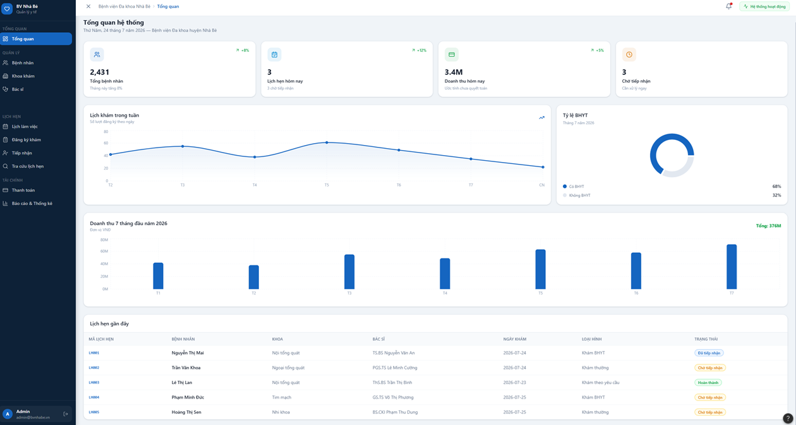
*Hình 3.3. Giao diện Trang chủ (Dashboard)*

---

### Quản lý Hồ sơ Bệnh nhân
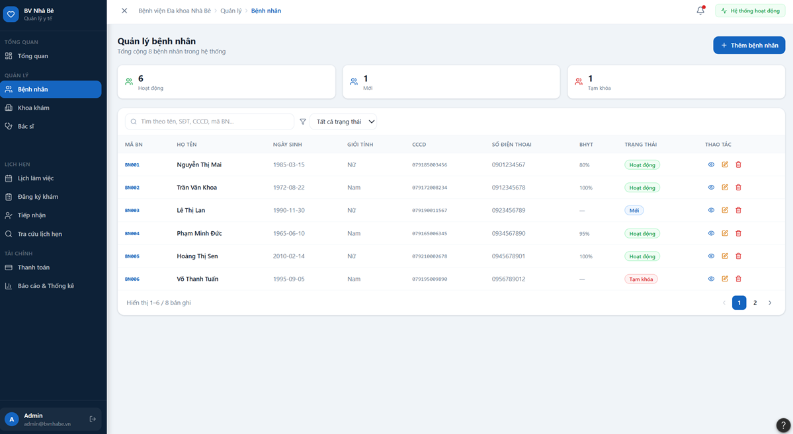
*Hình 3.4. Giao diện quản lý bệnh nhân*

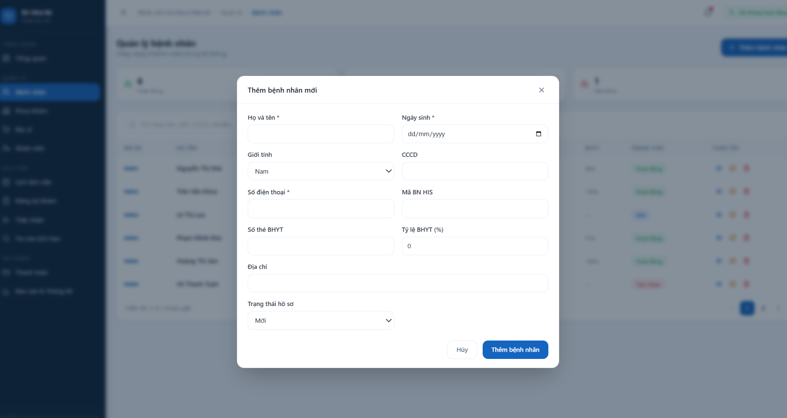
*Hình 3.5. Giao diện thêm bệnh nhân mới*

---

### Quản lý Bác sĩ & Khoa khám
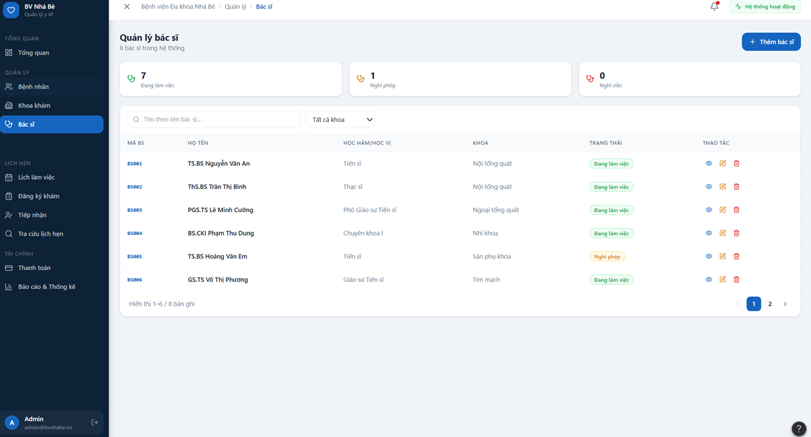
*Hình 3.6. Giao diện quản lý bác sĩ*

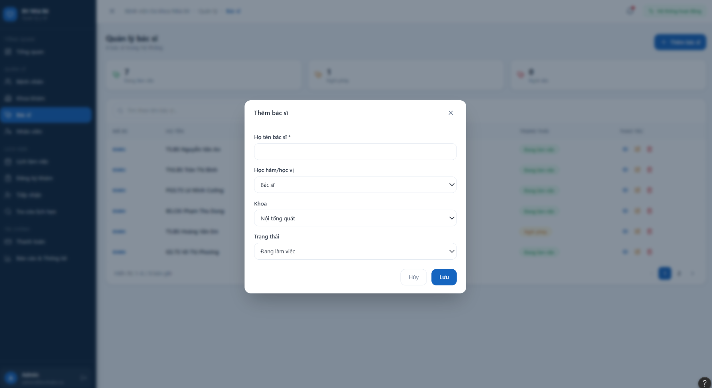
*Hình 3.7. Giao diện thêm bác sĩ mới*

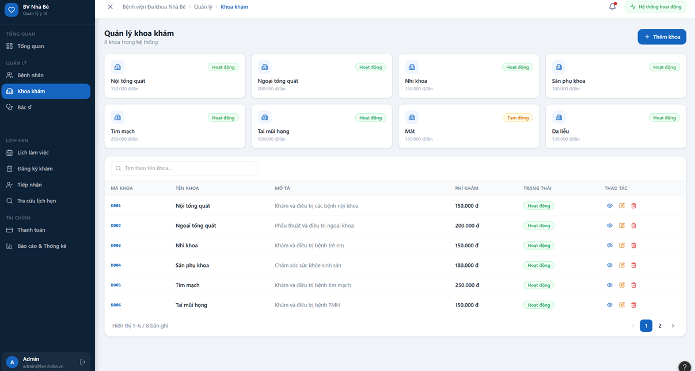
*Hình 3.8. Giao diện quản lý khoa khám*

---

### Quản lý Lịch làm việc & Lịch hẹn
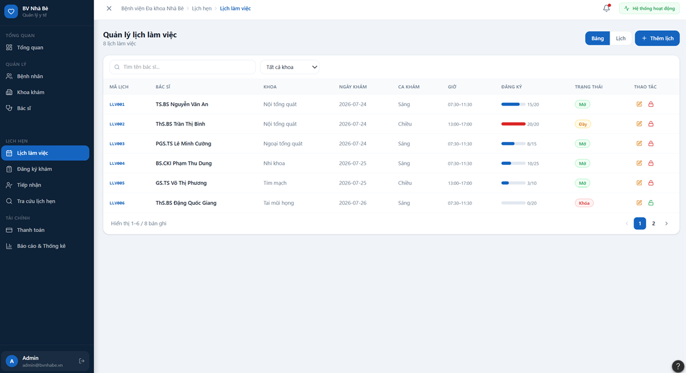
*Hình 3.9. Giao diện quản lý lịch làm việc*

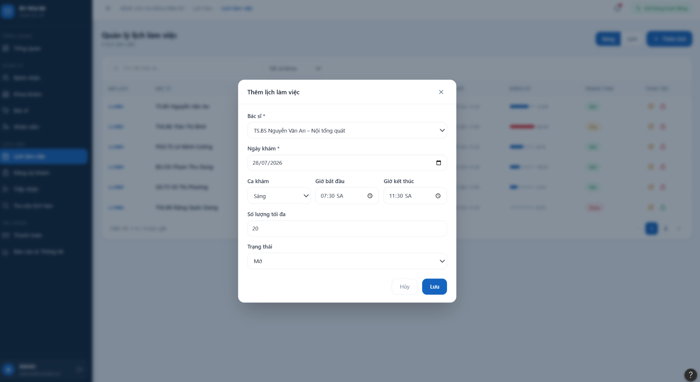
*Hình 3.10. Giao diện thêm lịch làm việc mới*

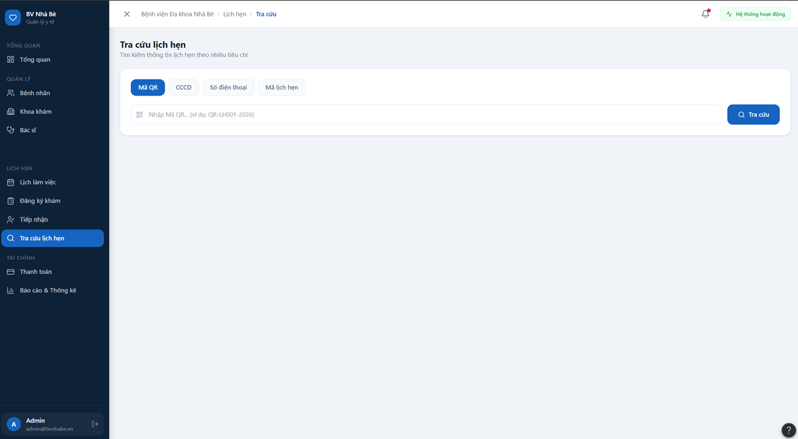
*Hình 3.11. Giao diện quản lý lịch hẹn*

---

### Quản lý Thanh toán
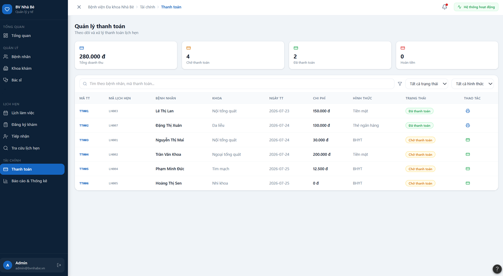
*Hình 3.12. Giao diện quản lý thanh toán*

---

## CÔNG CỤ SỬ DỤNG
* **Figma**: Thiết kế và mô phỏng giao diện người dùng (UI/UX Mockups & Interactive Prototype).
* **Claude AI**: Hỗ trợ chuẩn hóa dữ liệu mẫu (Mock Data) hiển thị trên giao diện và gợi ý bố cục thành phần (UI Layout Suggestions) theo chuẩn UX.
